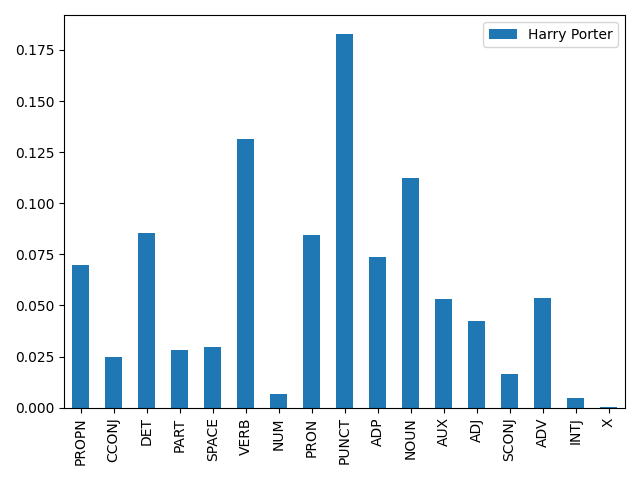

## POS Tagging Code
---

### 실제 데이터로 Pos Tagger 실행하기
Harry Porter txt를 다운받아서 실행해 보겠습니다.   

이 작업에는 pandas와 matplotlib가 필요합니다.   
이들을 설치해 보겠습니다.   

```
pip instasll pandas
pip install matplotlib
```

그 후 아래 코드를 입력해보세요.   

```
import spacy
nlp = spacy.load('en')

import pandas as pd
import matplotlib.pyplot as plt

harry_porter = open('HP1.txt').read()
hp = nlp(harry_porter)
hpSents = list(hp.sents)
hpSentenceLengths = [len(sent) for sent in hpSents]

tagDict = {w.pos: w.pos_ for w in hp}
hpPOS = pd.Series(hp.count_by(spacy.attrs.POS))/len(hp)
df = pd.DataFrame([hpPOS], index=['Harry Porter'])
df.columns = [tagDict[column] for column in df.columns]
df.T.plot(kind='bar')
plt.show()
```



아래와 같은 이미지가 나올 것입니다.   

가장 많이 나오는 pronoun을 찾기 위해서는 3줄만 추가하면 됩니다.   

```
from collections import Counter
hpAdjs = [w for w in hp if w.pos_ == 'PRON']
print(Counter([w.string.strip() for w in hpAdjs]).most_common(10))
```

결과가 다음과 같은 형태로 나올 것입니다.   

```
[('he', 1208), ('I', 919), ('it', 898), ('you', 838), ('He', 548), ('they', 506), ('him', 495), ('them', 324), ('It', 286), ('what', 260)]
```
