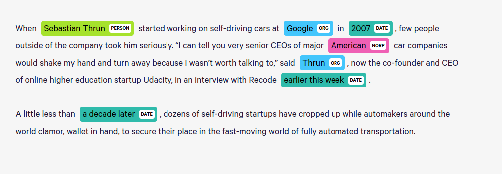

## NER Tagging Code
---

### displaCy
spaCy의 인상적인 부분 중 하나는 visualization이고, 이는 [displaCy](https://explosion.ai/demos/displacy-ent)에서 제공합니다.   



### 간단한 작업
spaCy를 이용하면 다음과 같은 간단한 작업을 할 수 있습니다.   

```
import spacy

nlp = spacy.load('en')

words, indices = [], []
for i, w in enumerate(nlp('Tom went to London before going to Paris ')):
    if w.ent_type_ == 'GPE':
        words.append(w.text_with_ws)
        indices.append(i)
    else:
        words.append(w.text_with_ws)

words[indices[0]], words[indices[1]] = words[indices[1]], words[indices[0]]
print(''.join(words))
```

'Tom went to London before going to Paris '라는 문장이 주어졌을 때 처음 나온 국가와 두 번째 나온 국가를 서로 바꾸는 작업입니다.   
결과는 다음과 같습니다.   

```
Tom went to Paris before going to London 
```

spaCy를 이용하면 이런 작업은 간단하게 처리할 수 있음을 보여줍니다.   