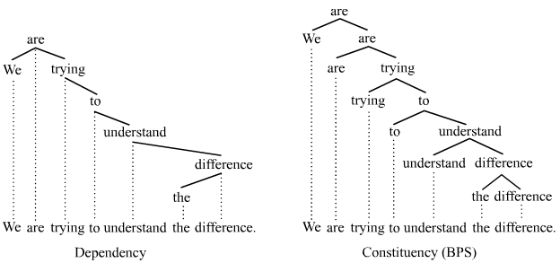

## Dependency Parsing
---

### Dependency Parsing이란?
Parsing은 텍스트에서 가져올 수 있는 가장 중요한 process 중 하나입니다.   
자연어에만 국한되어 있는 것이 아니라, 컴퓨터 언어에서도 마찬가지입니다.   
그런데 과연 parsing이란 정확히 무엇일까요?   

NLP의 세계에서, parsing은 단어로 이루어진 문장의 의미를 이해하는 것을 의미합니다.   
반면에, 컴퓨터 언어학에서는, parse tree를 만드는 알고리즘을 의미합니다.   

당연하게도, 우리는 단어로 이루어진 문장의 의미를 이해하는 것에 집중할 것입니다.   
parsing에는 많은 이론이 있으나, 2개가 가장 유명합니다 - dependency parsing과 phrase structure parsing   
우리는 dependency parsing에 집중할 것이지만, 둘 다 아는 것이 필요합니다.   

Dependency Parsing은 사실 parsing의 새로운 접근입니다.   
프랑스 언어학자 Lucien Tesniere가 이 이론을 생각해 냈습니다.   
반면에 Constituency Parsing은 Aristotle에서부터 시작된 아주 오래된 접근법입니다.   
이는 언어학의 아버지로 불리는 Noam Chomsky로부터 현대적으로 정리되었습니다.   

Dependency Parsing은 문장 내 단어들 사이의 의존도를 이해하는 것입니다.   
Dependency란 문장 내 단어들이 서로 직접적인 링크를 통해 연결되어 있다는 생각입니다.   
Phrase Structure Parsing(또는 Constituency Parsing)은 문장을 phrases나 분리된 구성 요소로 쪼개는 것입니다.   
그래서 dependency parsing은 우리에게 문장 내의 단어들의 관계에 대한 정보를 주는 반면에, constituency parsing은 문장을 어떻게 그룹핑할 수 있는지 이해하는데 도움을 줍니다.   

Dependency Parsing은 단어 사이에 관계나 의존도에 집중합니다.   
이 말은, 파싱 도중에 많은 종류의 dependencies가 등장할 수 있다는 말입니다.   
그 중 유명한 것은 semantic dependencies, morphological dependencies, prosodic dependencies, syntactic dependencies가 있습니다.   
여기에서는 우리는 syntatic dependency parsing에만 집중할 것입니다.   
그 이유는 대부분의 dependency parsing 작업이 syntatic dependency parsing에서 비롯된 것도 있고, spaCy가 syntatic depndency parser이기 때문이기도 합니다.   

'The dog is faster than the cat'이라는 문장을 봅시다.   
여기서 중요한 단어는 is로, 문장의 메인 동사입니다.   
The dog는 nsubj로 표시되어 문장의 주어 역할을 수행합니다.   
acomp는 형용사 보어로, 형용사를 꾸미거나 형용사에 의미를 더해주는 구나 절을 의미합니다.   
than은 전치사이고, pobj는 전치사의 목적어로, 여기서는 the cat을 말합니다.   

### Dependency Parsing을 하는 이유
다른 NLP task처럼, 하나의 과제를 하는 것은 다른 과제를 하는데 도움을 줍니다.   
이 경우에는 NER tagging에 도움을 줄 수 있습니다.   
또한, 기계 번역에서 semantic과 syntatic 정보는 굉장히 중요하기 때문에 이에 도움을 줄 수 있습니다.   

이런 종류의 그래프 표현법은 챗봇이나 어떤 과제를 하는지 이해해야 하는 시스템에서 중요할 수 있습니다.   
Parsing은 또한 문법적인 정확성을 검증하는데 도움을 주기도 합니다.   
또한, 비슷하게 생긴 문장에서 모호함을 제거하는데 도움을 줍니다.   