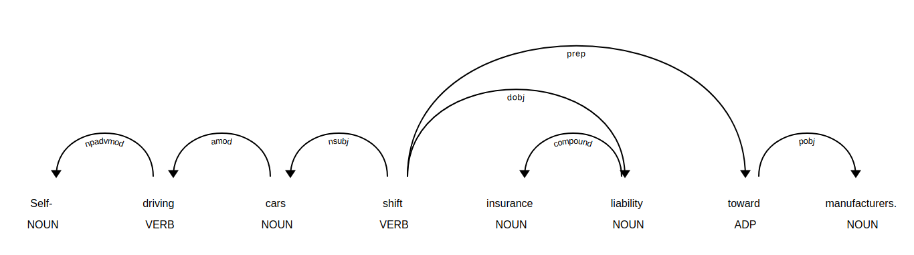

## Python에서 Dependency Parsing
---

### NLTK에서 Dependency Parsing
이전에 그래왔듯이, NLTK에서 먼저 시작해 봅시다.   
우리가 할 작업은 Stanford Dependency Parser를 이용하는 방법을 알아보는 것입니다.   
이 Parser는 Deprecated되었지만, 아직 사용할 수 있습니다.   

파일은 [https://nlp.stanford.edu/software/stanford-parser-4.0.0.zip](https://nlp.stanford.edu/software/stanford-parser-4.0.0.zip)에서 다운로드 받을 수 있습니다.   

```
from nltk.parse.stanford import StanfordDependencyParser
path_to_jar = 'stanford-parser-4.0.0/stanford-parser.jar'
path_to_models_jar = 'stanford-parser-4.0.0/stanford-parser-4.0.0-models.jar'
dependency_parser = StanfordDependencyParser(path_to_jar=path_to_jar, path_to_models_jar=path_to_models_jar)

result = dependency_parser.raw_parse('I shot an elephant in my sleep')
dep = result.__next__()
print(list(dep.triples()))
```

결과는 다음과 같이 나옵니다.   

```
[(('shot', 'VBD'), 'nsubj', ('I', 'PRP')), (('shot', 'VBD'), 'obj', ('elephant', 'NN')), (('elephant', 'NN'), 'det', ('an', 'DT')), (('shot', 'VBD'), 'obl', ('sleep', 'NN')), (('sleep', 'NN'), 'case', ('in', 'IN')), (('sleep', 'NN'), 'nmod:poss', ('my', 'PRP$'))]
```

shot이라는 verb가 tree의 root를 차지하는 것을 알 수 있습니다.   
NLTK에서 간단하게 어떻게 이루어지는지 알아보았고, 이제는 spaCy로 넘어가겠습니다.   

### spaCy에서 Dependency Parsing
만약 모든 단원을 따라왔다면, 당신은 사실 dependency parsing을 여러 번 해봤을 것입니다.   
Text를 nlp 돌리는 작업에 dependency parsing이 포함되어 있기 때문입니다.   

다음 코드를 실행해 봅시다.   

```
import spacy
nlp = spacy.load('en')

sent_0 = nlp('Myriam saw Clement with a telescope.')
sent_1 = nlp('Self-driving cars shift insurance liability toward manufacturers.')
sent_2 = nlp('I shot the elephant in my pyjamas.')

for chunk in sent_0.noun_chunks:
    print((chunk.text, chunk.root.text, chunk.root.dep_, chunk.root.head.text))
```

결과는 다음과 같이 나올 것입니다.   

```
('Myriam', 'Myriam', 'nsubj', 'saw')
('Clement', 'Clement', 'dobj', 'saw')
('a telescope', 'telescope', 'pobj', 'with')
```

이제 우리는 chunk와 root text, dependency type, head를 알 수 있습니다.   
예상했듯, 동사 saw는 Myriam과 Clement의 head이고, Myriam은 주어, Clement는 목적어입니다.   

다음 문장을 실행해 봅시다.   

```
for chunk in sent_1.noun_chunks:
    print((chunk.text, chunk.root.text, chunk.root.dep_, chunk.root.head.text))
```

결과는 다음과 같이 나옵니다.   

```
('Self-driving cars', 'cars', 'nsubj', 'shift')
('insurance liability', 'liability', 'dobj', 'shift')
('manufacturers', 'manufacturers', 'pobj', 'toward')
```

3개의 명사구가 나옵니다.   
Self-driving cars와 insuarce liability는 각각 root noun인 cars와 liability를 꾸미는 self-driving과 insurance로 이루어져 있습니다.   
manufacturers는 toward의 목적어인 명사입니다.   

마지막 문장을 실행해 봅시다.   

```
for chunk in sent_2.noun_chunks:
    print((chunk.text, chunk.root.text, chunk.root.dep_, chunk.root.head.text))
```

결과는 다음과 같습니다.   

```
('I', 'I', 'nsubj', 'shot')
('the elephant', 'elephant', 'dobj', 'shot')
('my pyjamas', 'pyjamas', 'pobj', 'in')
```

the와 my는 elephant와 pyjamas를 꾸며주고, 명사구 안에 포함되어 있습니다.   

이번에는 phrases보다는 individual words를 중심으로 보겠습니다.   

```
for token in sent_0:
    print((token.text, token.dep_, token.head.text, token.head.pos_, [child for child in token.children]))
```

위 코드의 결과는 다음과 같습니다. 

```
('Myriam', 'nsubj', 'saw', 'VERB', [])
('saw', 'ROOT', 'saw', 'VERB', [Myriam, Clement, with, .])
('Clement', 'dobj', 'saw', 'VERB', [])
('with', 'prep', 'saw', 'VERB', [telescope])
('a', 'det', 'telescope', 'NOUN', [])
('telescope', 'pobj', 'with', 'ADP', [a])
('.', 'punct', 'saw', 'VERB', [])
```

다음 문장에서도 쉽게 결과를 확인해 볼 수 있습니다.   

```
for token in sent_1:
    print((token.text, token.dep_, token.head.text, token.head.pos_, [child for child in token.children]))
```

그 결과는 다음과 같습니다.   
```
('Self', 'npadvmod', 'driving', 'VERB', [])
('-', 'punct', 'driving', 'VERB', [])
('driving', 'amod', 'cars', 'NOUN', [Self, -])
('cars', 'nsubj', 'shift', 'VERB', [driving])
('shift', 'ROOT', 'shift', 'VERB', [cars, liability, toward, .])
('insurance', 'compound', 'liability', 'NOUN', [])
('liability', 'dobj', 'shift', 'VERB', [insurance])
('toward', 'prep', 'shift', 'VERB', [manufacturers])
('manufacturers', 'pobj', 'toward', 'ADP', [])
('.', 'punct', 'shift', 'VERB', [])
```

이 결과에서도 root verb인 shift가 다양한 단어들과 연결되어 있음을 확인할 수 있습니다.   
이를 displaCy로 확인해 보겠습니다. 

```
spacy.displacy.serve(sent_1, style='dep')
```



한결 이해가 쉬울 겁니다.   

Tree를 iterate해서 sentence의 head가 하나만 존재한다는 것을 보일 수 있습니다.   
모든 가능한 주어들을 iterate해서 verb인 head를 추가해 보겠습니다.   

```
from spacy.symbols import nsubj, VERB

verbs = set()
for possible_subject in sent_1:
    if possible_subject.dep == nsubj and possible_subject.head.pos == VERB:
        verbs.add(possible_subject.head)

print(verbs)
```

우리가 예상했던 대로 결과가 나오게 됩니다.   

```
{shift}
```

다음 코드를 실행해 보십시오.   

```
root = [token for token in sent_1 if token.head == token][0]
subject = list(root.lefts)[0]
for descendant in subject.subtree:
    print((descendant.text, descendant.dep_, descendant.n_lefts,
          descendant.n_rights, [ancestor.text for ancestor in descendant.ancestors]))
```

root를 token의 head가 자기 자신인지 체크해서 찾을 수 있습니다.   
subject는 tree의 왼쪽에 있게 됩니다.   
n_lefts는 왼쪽에 있는 자식들의 개수이고, n_rights는 오른쪽에 있는 자식들 개수입니다.   
ancestors는 모든 조상 노드들을 가지고 있습니다.   
이 코드 실행 결과는 다음과 같습니다.   

```
('Self', 'npadvmod', 0, 0, ['driving', 'cars', 'shift'])
('-', 'punct', 0, 0, ['driving', 'cars', 'shift'])
('driving', 'amod', 2, 0, ['cars', 'shift'])
('cars', 'nsubj', 1, 0, ['shift'])
```
