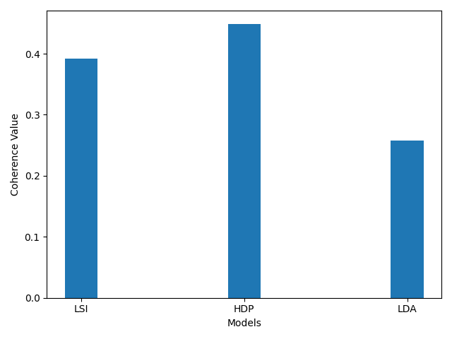

## Topic Model 평가
---

### Topic Coherence
지난 장에서는 어떻게 topic model을 다룰 수 있는지에 대해 알아보았습니다.   
이에 더하여 Topic Model이 잘 구성되었는지 평가하는 것도 중요합니다.   
Topic Model을 평가하는 방법 중 가장 유명한 것은 Topic Coherence입니다.   
Gensim에서는 다행히 topic coherence를 쉽게 할 수 있도록 했습니다.   

Topic Coherence는 쉽게 말하면, topic이 사람에게 얼마나 해석 가능한지를 측정하는 방법입니다.   
이와 관련된 내용은 흥미가 있다면 찾아보면 좋습니다.   

Topic Coherence는 정량적인 척도를 제시합니다.   
우리는 이 방식을 통해서 LDA와 HDP, LSI 모델들을 비교할 수 있습니다.   

당연하게도, 우리는 모델을 평가하기 위해 정성적인 척도를 사용할 수 있습니다.   
Visualizing은 한 가지 예 중 하나입니다.   

다음 코드를 실행해 보겠습니다.   

```
import os
import gensim

test_data_dir = '{}'.format(os.sep).join([gensim.__path__[0], 'test', 'test_data'])
lee_train_file = test_data_dir + os.sep + 'lee_background.cor'
text = open(lee_train_file).read()

import spacy
nlp = spacy.load("en")

my_stop_words = [u'say', u'\'s', u'Mr', u'be', u'said', u'says', u'saying']
for stopword in my_stop_words:
    lexeme = nlp.vocab[stopword]
    lexeme.is_stop = True

doc = nlp(text)

from gensim.models import CoherenceModel, LdaModel, LsiModel, HdpModel
from gensim.corpora import Dictionary

# we add some words to the stop word list
texts, article, skl_texts = [], [], []
for w in doc:
    # if it's not a stop word or punctuation mark, add it to our article!
    if w.text != '\n' and not w.is_stop and not w.is_punct and not w.like_num:
        # we add the lematized version of the word
        article.append(w.lemma_)
    # if it's a new line, it means we're onto our next document
    if w.text == '\n':
        skl_texts.append(' '.join(article))
        texts.append(article)
        article = []

bigram = gensim.models.Phrases(texts)
texts = [bigram[line] for line in texts]

dictionary = Dictionary(texts)
corpus = [dictionary.doc2bow(text) for text in texts]

ldamodel = LdaModel(corpus=corpus, num_topics=10, id2word=dictionary)
lsimodel = LsiModel(corpus=corpus, num_topics=10, id2word=dictionary)
hdpmodel = HdpModel(corpus=corpus, id2word=dictionary)

lsitopics = [[word for word, prob in topic] for topicid, topic in lsimodel.show_topics(formatted=False)]
hdptopics = [[word for word, prob in topic] for topicid, topic in hdpmodel.show_topics(formatted=False)]
ldatopics = [[word for word, prob in topic] for topicid, topic in ldamodel.show_topics(formatted=False)]

lda_coherence = CoherenceModel(topics=ldatopics, texts=texts, dictionary=dictionary, window_size=10).get_coherence()
lsi_coherence = CoherenceModel(topics=lsitopics[:10], texts=texts, dictionary=dictionary, window_size=10).get_coherence()
hdp_coherence = CoherenceModel(topics=hdptopics[:10], texts=texts, dictionary=dictionary, window_size=10).get_coherence()

import matplotlib.pyplot as plt
import numpy as np


def evaluate_bar_graph(coherences, indices):
    """
    Function to plot bar graph.

    coherences: list of coherence values
    indices: Indices to be used to mark bars. Length of this and coherences should be equal.
    """
    assert len(coherences) == len(indices)
    n = len(coherences)
    x = np.arange(n)
    plt.bar(x, coherences, width=0.2, tick_label=indices, align='center')
    plt.xlabel('Models')
    plt.ylabel('Coherence Value')
    plt.show()

evaluate_bar_graph([lsi_coherence, hdp_coherence, lda_coherence], ['LSI', 'HDP', 'LDA'])

```

결과는 다음과 같이 그래프로 나옵니다.   



수치는 다를 수 있지만, HDP가 coherence 값이 가장 크게 나옵니다.   

이 방법을 통해 적절한 topic의 개수도 알 수 있습니다.   
다음 코드를 실행해 보겠습니다.   

```
import os
import gensim

test_data_dir = '{}'.format(os.sep).join([gensim.__path__[0], 'test', 'test_data'])
lee_train_file = test_data_dir + os.sep + 'lee_background.cor'
text = open(lee_train_file).read()

import spacy
nlp = spacy.load("en")

my_stop_words = [u'say', u'\'s', u'Mr', u'be', u'said', u'says', u'saying']
for stopword in my_stop_words:
    lexeme = nlp.vocab[stopword]
    lexeme.is_stop = True

doc = nlp(text)

from gensim.models import CoherenceModel, LdaModel, LsiModel, HdpModel
from gensim.corpora import Dictionary

# we add some words to the stop word list
texts, article, skl_texts = [], [], []
for w in doc:
    # if it's not a stop word or punctuation mark, add it to our article!
    if w.text != '\n' and not w.is_stop and not w.is_punct and not w.like_num:
        # we add the lematized version of the word
        article.append(w.lemma_)
    # if it's a new line, it means we're onto our next document
    if w.text == '\n':
        skl_texts.append(' '.join(article))
        texts.append(article)
        article = []

bigram = gensim.models.Phrases(texts)
texts = [bigram[line] for line in texts]

dictionary = Dictionary(texts)
corpus = [dictionary.doc2bow(text) for text in texts]

c_v = []
limit = 10
for num_topics in range(1, limit):
    lm = LdaModel(corpus=corpus, num_topics=num_topics, id2word=dictionary)
    cm = CoherenceModel(model=lm, texts=texts, dictionary=dictionary, coherence='c_v')
    c_v.append(cm.get_coherence())
    
print(c_v)
```

다음과 같은 결과가 나옵니다.   

```
[0.23324417494488206, 0.21944780090078028, 0.22975285751205635, 0.18085842710722574, 0.20896619408709233, 0.2312718083756898, 0.2236707825304658, 0.2258011762167476, 0.21611102519155637]
```
가장 coherence가 높은 1개의 topic이 좋은 것 같습니다.   
