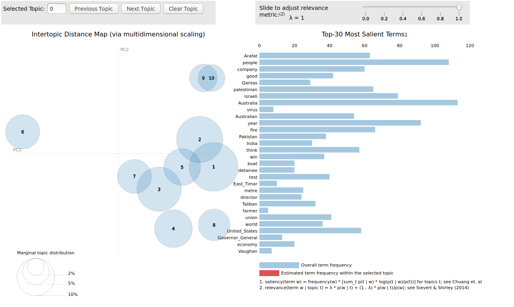

## Topic 모델 시각화
---

앞에서 말했듯이, topic model의 목표는 텍스트를 이해하기 쉽게 하는 것입니다.   
그리고, 텍스트 이해에 가장 좋은 방법 중 하나는 시각화입니다.   

가장 유명한 topic modeling visualization 라이브러리는 LDAvis로 R library를 python으로 porting한 것입니다.   

설치는 다음과 같이 할 수 있습니다.   

```
pip install pyLDAvis
pip install IPython
```

다음 코드를 실행해 보겠습니다.   

```
import os
import gensim

test_data_dir = '{}'.format(os.sep).join([gensim.__path__[0], 'test', 'test_data'])
lee_train_file = test_data_dir + os.sep + 'lee_background.cor'
text = open(lee_train_file).read()

import spacy
nlp = spacy.load("en")

my_stop_words = [u'say', u'\'s', u'Mr', u'be', u'said', u'says', u'saying']
for stopword in my_stop_words:
    lexeme = nlp.vocab[stopword]
    lexeme.is_stop = True

doc = nlp(text)

from gensim.models import CoherenceModel, LdaModel, LsiModel, HdpModel
from gensim.corpora import Dictionary

# we add some words to the stop word list
texts, article, skl_texts = [], [], []
for w in doc:
    # if it's not a stop word or punctuation mark, add it to our article!
    if w.text != '\n' and not w.is_stop and not w.is_punct and not w.like_num:
        # we add the lematized version of the word
        article.append(w.lemma_)
    # if it's a new line, it means we're onto our next document
    if w.text == '\n':
        skl_texts.append(' '.join(article))
        texts.append(article)
        article = []

bigram = gensim.models.Phrases(texts)
texts = [bigram[line] for line in texts]

dictionary = Dictionary(texts)
corpus = [dictionary.doc2bow(text) for text in texts]

model = LdaModel(corpus=corpus, num_topics=10, id2word=dictionary)

import pyLDAvis.gensim
data = pyLDAvis.gensim.prepare(model, corpus, dictionary)
pyLDAvis.display(data)
pyLDAvis.show(data)
```



다음과 같이 인터넷이 동작하면서 다양한 정보를 알 수 있습니다.   