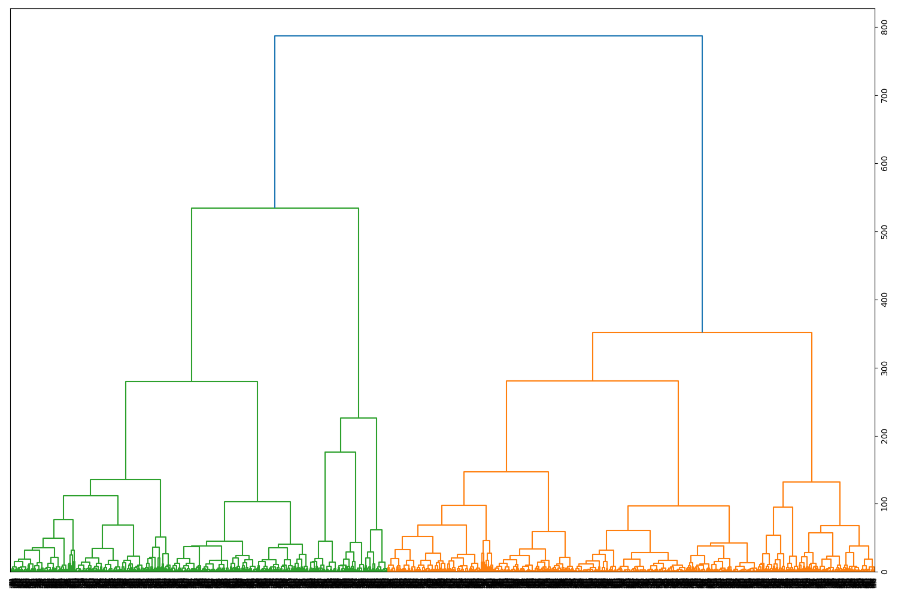

## 계층적 Clustering
---

Hierarchical clustering은 계층적 트리 모형을 이용해서 개별 개체들을 순차적으로 묶어나가는 것을 말합니다.   
우리는 Ward의 알고리즘을 통해 계층적 클러스터링을 할 것입니다.   

이 알고리즘은 가장 오래된 방법 중 하나로, cluster를 build하고, 정렬하면서 진행합니다.   
우리 예제에서는 dendrogram으로 cluster를 표현하겠습니다.   

```
from sklearn.metrics.pairwise import cosine_similarity
dist = 1 - cosine_similarity(X)

from scipy.cluster.hierarchy import ward, dendrogram

linkage_matrix = ward(dist)
fig, ax = plt.subplots(figsize=(10, 15))
ax = dendrogram(linkage_matrix, orientation='right')
plt.show()
```

결과는 다음과 같습니다.   



x축은 name이나 document의 index를 의미하지만, 너무 많은 document가 있기 때문에 지금은 잘 보이지 않습니다.   
y축은 cluster 사이의 거리를 의미합니다.   

우리가 볼 수 있듯이 이 방법은 document가 너무 많기 때문에 가장 좋은 방법이 아닐 수 있습니다.   
이 방법은 document와 cluster가 표현하는 것 사이의 관계를 찾기가 어렵습니다.   
작은 corpus에서는 충분히 좋을 수 있습니다.   

